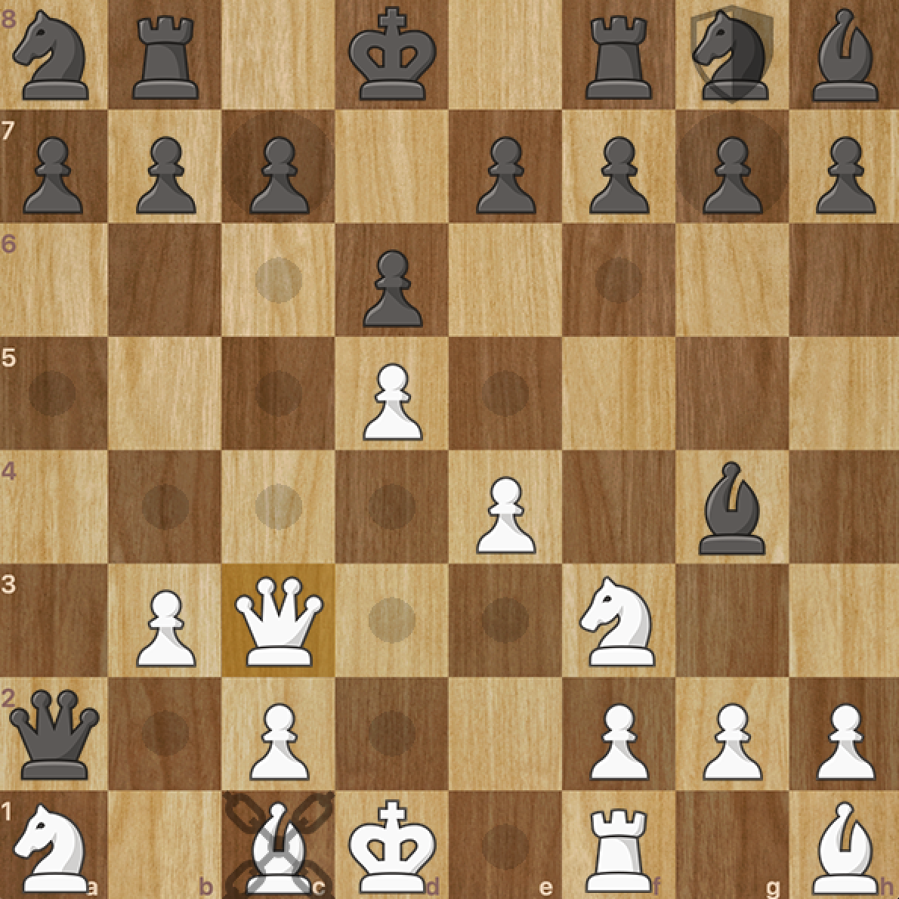

# SurpriseChess

Surprise Chess is a special variant of chess that incorporates random effects or 'surprises' that make the game intense and unpredictable. These include:

- **Shuffled** starting position (similar to Chess960)
- **Paralysis**: a piece may be unable to move
- **Shield**: a piece may receive protection against captures
- **Morphing**: a piece may turn into a different piece
- **Invisibility**: the opponent's pieces may become invisible

Available game modes:

- Player vs Bot
- Player vs Player


## Installation

Clone the repository:

```bash
git clone https://github.com/lengvietcuong/surprise-chess.git
```

## Usage

- Run the program (e.g. in Visual Studio)
- Choose the game mode you'd like to play
- Click on a piece to see its legal moves, then click on one of the indicated squares to move there



## Demo

Watch an intense game here: https://www.youtube.com/watch?v=BCpvrlOuHBg